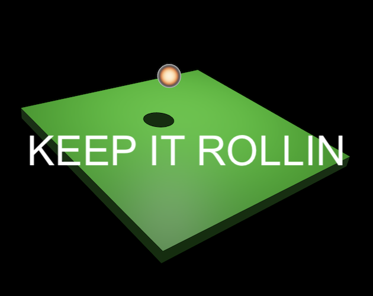

# Keep It Rollin 🏐

Contain an energetic quantum particle by strategically placing walls in this 48-hour jam game. Created with [Bevy][bevy_engine_home].

[Play on Itch.io][keep_it_rollin_itch_io] · [YouTube Trailer][keep_it_rollin_youtube]

## Platforms

The game currently runs on the `Web` via **WebAssembly**. `Windows`, `Linux` and `Mac` builds will be added soon!

## Gameplay

Contain a newly discovered quantum particle by placing walls to "Keep it Rollin" on the panels that de energize it. This particle is highly energetic and will escape if not properly controlled. Your goal is to strategically place walls to prevent its fall out and maintain its velocity, all while minimizing exposure to its radiation that can damage the containment panels underneath it.

### Objective

Your goal is to effectively contain and de-energize the explosive quantum particle, aiming to maximize its time on the panels to achieve higher scores.

### Controls (Keyboard ⌨ + Mouse 🖱️)

- `Mouse`: Use the mouse to interact with the game environment. **Click** the `Left Mouse Button (LMB)` to place the **wall** at the desired location by *hovering your mouse over the panels*.
- `Keyboard`: Use the `A`/`D` key to _rotate_ the panel wall **anticlockwise**/**clockwise**, while placing.

Note: The particle is energetic and will **roll on its own**. Also you may need to LMB click inside the game window for the first time when running in browser, subsequent clicks will work fine!​

## Motivations

- I was already digging [Bevy Engine][bevy_engine_home], and I wanted to see if I could pull off cooking up a game idea real quick. I had this hunch that Bevy would be my go-to for crafting a game in just **48 hours**.
- When the theme **"Infinity"** popped up, my brain went into overdrive. It didn't take long to whip up this fun physics-based casual game idea that just screams **"infinite play"** fitting the endless nature of the game.
- I kept it simple, all about the code – no fancy assets. That let me jump right into the fun part, making the game, and I managed to put together a prototype in **~24 hours**!

## About

- Born during a 48-hour game 📆 jam centered around the theme of "Infinity" hosted by Nikhil Malankar.
- Developed using the [Bevy Engine 🕊️][bevy_engine_home].

## Inspiration and Credits

- [Bevy Glowy Orb tutorial][bevy_glowy_orb_tutorial] by [DGriffin91][dgriffin91_github]: Used this shader for the particle's material.

## Feedback

Would love your inputs! Feel free to provide feedback and contribute to the game's improvement.

[keep_it_rollin_itch_io]: https://nilaysavant.itch.io/keep-it-rollin
[keep_it_rollin_youtube]: https://youtu.be/26DM3uq3MNw
[bevy_engine_home]: https://bevyengine.org/
[dgriffin91_github]: https://github.com/DGriffin91
[bevy_glowy_orb_tutorial]: https://github.com/DGriffin91/bevy_glowy_orb_tutorial
